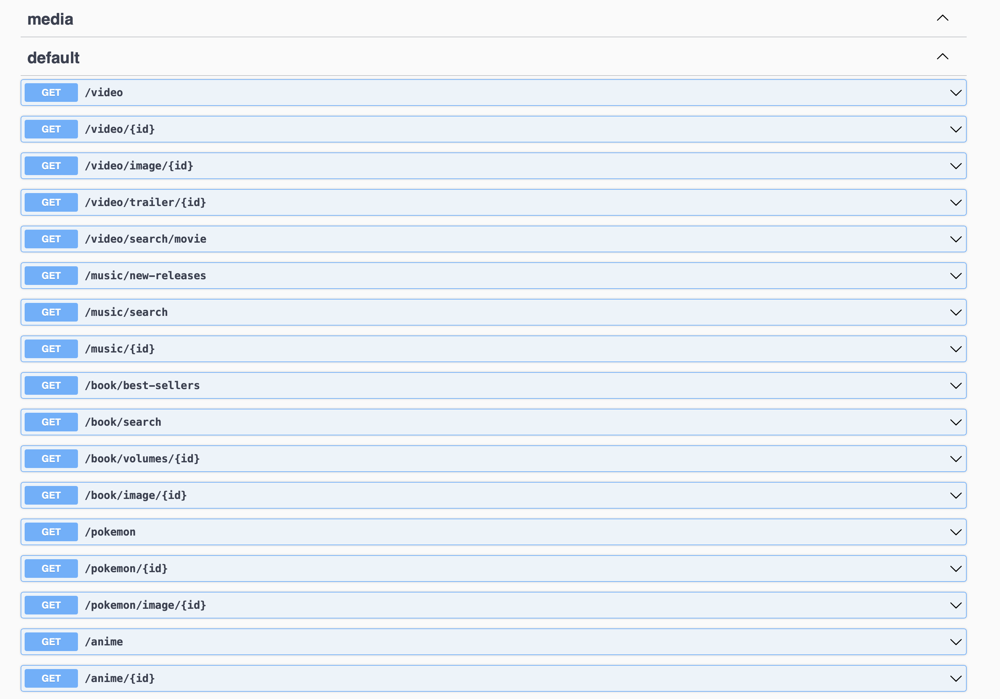

# Media Library BackEnd
<div>
  <a href="https://github.com/nestjs/nest">
    
  </a>
</div>

Media Library backend server based on NestJS, provide data of video, music, book, etc. Project to learn Nestjs and RxJS. Used for [MediaLibrary](https://github.com/SunsetFrost/MediaLibrary)

## Setup
### Requirement
- nodejs
- yarn
- .env(api key)

add your .env file to project, like
```yml
TMDB_API_KEY=XX
SPOTIFY_CLIENTID=XX
SPOTIFY_CLIENTSECRET=XX
NYTIMES_API_KEY=XX
GOOGLE_BOOK_API_KEY=XX

```

### Install
```bash
yarn
yarn dev
```

#### Swagger
swagger doc location is localhost:3000/api


## API Source
### Video
- API source  
[the movie db](https://www.themoviedb.org/documentation/api?language=en-US)
### Music
- API source  
[spotify music](https://developer.spotify.com/documentation/web-api/)

### Book
- API source  
google book api
[NYTIMES_API](https://developer.nytimes.com/docs/books-product/1/overviews)
### Pokemon
- API source  
[PokeAPI](https://pokeapi.co)

## Learn Blog
### Send mutiple parallel http request and then gather together
[blog](https://riptutorial.com/rxjs/example/27973/sending-multiple-parallel-http-requests)  
[blog](https://www.faircloth.xyz/3-ways-make-multiple-http-requests-rxjs/amp/)
### mergemap vs switchmap vs concatmap
[blog](https://blog.angular-university.io/rxjs-higher-order-mapping/)
